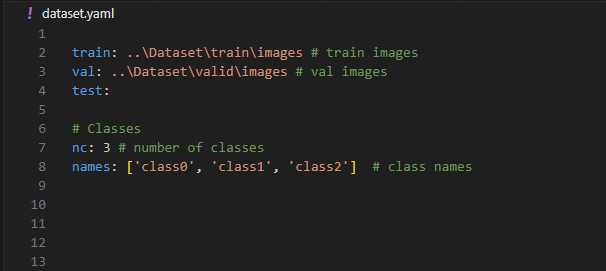
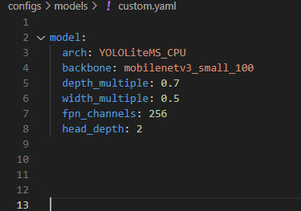

# YOLOLite – Lightweight YOLO for PyTorch (ONNX export)

[BENCHMARK](BENCHMARK.md)

🔥 TL;DR – Benchmark Summary

This repo focuses on ultra-fast, CPU-friendly object detection models for real industrial use.

 - edge_n (0.55M params) delivers ~0.62 mAP@0.5 while running at ~24 ms @640px and ~9 ms @320px, reaching 100–200+ FPS on CPU.

 - edge_m (2.95M params) reaches YOLOv5-level accuracy with 5–10× fewer parameters.

 - Extreme edge mode (320px + P2) shows real-time CPU performance above 100 FPS with stable accuracy on small-object datasets.

 - yololite_n/m achieve the highest accuracy (0.69–0.70 mAP) but are GPU-oriented and not the primary focus.

Overall: edge models provide the best accuracy-to-latency ratio for CPU deployments, making them ideal for Raspberry Pi, industrial PCs, embedded systems, and automation pipelines.

## Dataset and training
Construct yaml as follow: 
    

    Expected structure of dataset:

    dataset --
        --train
            --images
                -- image1.jpg
                ...
            --labels
                --image1.txt #Yoloformat 
                ...
        --valid
            --images
            --labels
        --test
            --images
            --labels

    --model, type=str, required=True, help="Path to model.yaml"
    --train, default="configs/train/standard_train.yaml", type=str, required=False, help="Path to train.yaml"
    --data,   type=str, required=True, help="Path to data.yaml"
    --epochs, type=int, default=200
    --batch_size, type=int, default=16
    --device, type=str, default=0  "0", "cpu"
    --img_size, type=int, default=640
    --workers, type=int, default=4
    --augment, default=True, action=argparse.BooleanOptionalAction swap with --no--augment
    --use_p6,  default=False, action=argparse.BooleanOptionalAction  #swaps p5 with p6 head 
    --use_p2,  default=False, action=argparse.BooleanOptionalAction  #swaps p3 with p2 head  
    --use_resize, default=False, action=argparse.BooleanOptionalAction, help = "Uses resize instead of letterbox"
    --resume, type=str, default=None, help="Resume training from last checkpoint if available set path to checkpoint"
    --lr, type=float, default=None, help="Override learning rate if set"
    --save_every", type=int, default=25, help="Save every x epoch"
    --save_by, type=str, default='AP', help="Save best model by coco evaluation, viable settings [AP50, AP75, AP, AR, APS, APM, APL]"

pip install -r requirements.txt

    python tools/train.py --model configs/your_model.yaml --data dataset.yaml --epochs 100 --img_size 640

To resume training:

LR is by default 0.001, when resuming training you might want to lower it with --lr 

    python tools/train.py --model "runs/train/1/merged_config" --data "path_to_dataset.yaml" --resume "runs/train/1/best_model_state.pt" --lr 0.0001

To create a custom model use the custom.yaml template and choose any backbone available in timm:

 - backbone: any
 - depth_multiple: 0.7 / float
 - width_multiple: 0.5 / float
 - fpn_channels: 256 /int divisible with 8/32
 - head_depth: 2 /int

## Inference

To test trained models inference use tools/infer.py:
    Image gets saved to runs/infer/x 

    
    --weights, required=True, help="Path to checkpoint (.pt/.pth)"
    --img, default=None, help="Picture"
    --img_dir, default=None, help="Folder with images (jpg/png)"
    --img_size, type=int, default=0, help="Override  meta.img_size (0 = use meta)
    --device, default="0"
    --conf, type=float, default=0.25
    --iou, type=float, default=0.50
    --max_det, type=int, default=300
    --save_txt, action="store_true", help="Saves YOLO-format txt per img"
    
    python tools/infer.py --weights runs/train/1/best_model_state.pt --img "image1.jpg"

## Export to onnx 

    --weights", required=True, help="Path to checkpoint (.pt/.pth)
    --out", Default: runs/export/<n>/model.onnx|_decoded.onnx
    --img-size", type=int, default=640
    --device", default="cpu", help="'cpu' '0'
    --opset", type=int, default=17
    --simplify", action="store_true", help="onnxsim after export"
    --dynamic-batch", action="store_true", help="Dynamic batch-dimension
    --dynamic-shape", action="store_true", help="Dynamisk H/W (only format=raw)
    --format", choices=["raw", "decoded"], default="decoded" help="raw = per lvl; decoded = boxes/obj/cls (no NMS)")
    --verbose", action="store_true", help="More print"

    python export/export_onnx.py --weights runs/train/1/best_model_state.pt --img-size 640 --device cpu --simplify

## Test inference speed:

    Prints: 
    === Inference timing (ms) ===
    pre_ms    mean 24.27 | std 0.00 | p50 24.27 | p90 24.27 | p95 24.27
    infer_ms  mean 58.78 | std 0.00 | p50 58.78 | p90 58.78 | p95 58.78
    post_ms   mean 1.17 | std 0.00 | p50 1.17 | p90 1.17 | p95 1.17
    total_ms  mean 84.23 | std 0.00 | p50 84.23 | p90 84.23 | p95 84.23
    Throughput ≈ 11.87 img/s

    --model", required=True, help="Path till decoded .onnx"
    --img", default=None
    --img_dir", default=None
    --img_size", type=int, default=640, help="Must match ONNX decoded img_size"
    --conf", type=float, default=0.30
    --iou", type=float, default=0.30
    --max_det", type=int, default=300
    --no_letterbox", action="store_true"
    --save_txt", action="store_true"
    --names", default=None, help="class1,class2,class3 etc or classes.txt
    --providers", default="cpu", choices=["cpu","cuda","tensorrt"]
    --warmup, type=int, default=10
    --runs, type=int, default=1, 
    --intra, type=int, default=0, help="intra_op_num_threads (0=auto)"
    --inter, type=int, default=0, help="inter_op_num_threads (0=auto)"

    python export/infer_onnx.py --model runs/export/1/model_decoded.onnx --img image1.jpg --img_size 640

